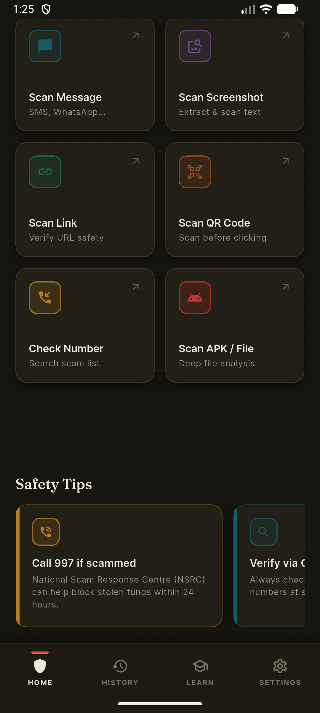
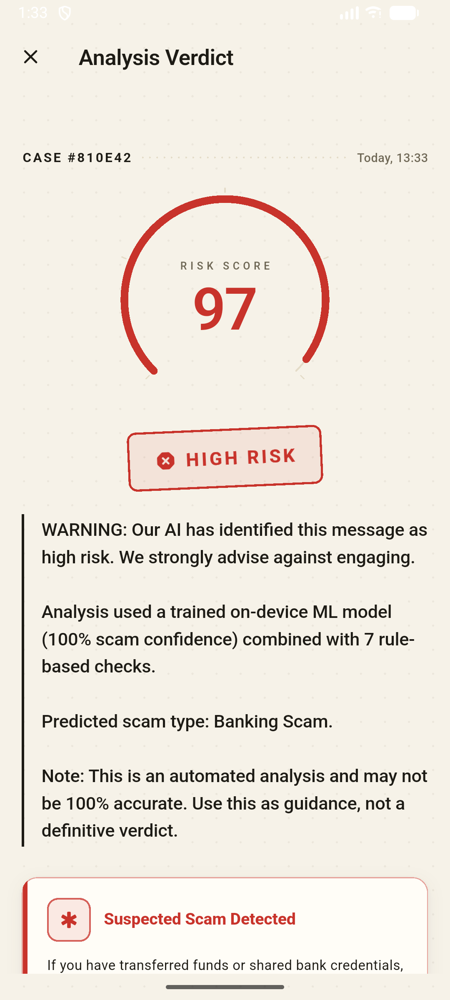
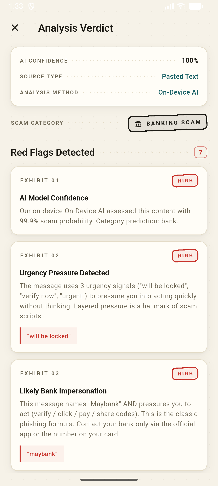
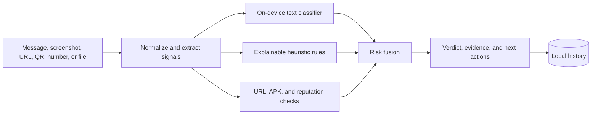
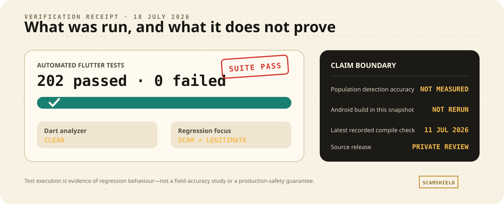

# ScamShield - Engineering Case Study

**A privacy-first Android prototype for explaining and reducing Malaysian scam risk.**

ScamShield started as my Flutter project for the Young Innovators Challenge
2026. It combines an on-device text classifier with explainable rules, link
and file checks, screenshot OCR, QR scanning, local history, and optional
community reputation lookups.

This repository is a public engineering case study. The application source remains private while dataset provenance, competition material, Firebase configuration, and historical credentials are reviewed for a safe release.

## Product flow

  
  
  

The displayed `97/100` risk score and `100%` model value are outputs for a
synthetic demo message, not measured detection accuracy or a calibrated
probability.

The interface is designed to answer three questions:

1. **How risky is this?** — a prototype risk score and risk band.
2. **Why was it flagged?** — specific evidence such as urgency, impersonation, suspicious links, or requests for credentials.
3. **What should I do next?** — practical steps, including contacting the organisation through an official channel and calling Malaysia's NSRC 997 after a transfer.

## Engineering design

### Privacy boundary

- Core message analysis and OCR are designed to run on-device.
- Scan history is stored locally and can be cleared.
- Optional reputation lookups send only the lookup value required by that service and can be disabled.
- Firebase is optional for the prototype's core analysis path.

### Explainability

The rules distinguish weak signals from combinations. A bank name alone should not condemn a legitimate receipt; a bank name plus urgency, a non-official link, and a request for an OTP is a much stronger phishing pattern. The result screen exposes the triggered evidence instead of presenting an unexplained label.

## Verification evidence

  

This dated test record reports regression execution, not detection
accuracy. The public case study keeps the distinction visible instead of
turning a test count into a safety claim.

On **18 July 2026**, I reran the available checks and recorded:

- 202 automated Flutter tests passing;
- a clean Dart analyzer run;
- regression corpora covering Malaysian scam patterns and legitimate-message false positives.

I did not rerun the Android build while preparing this public case study. The
project record contains a successful compilation check from 11 July 2026.

Those results are a project snapshot, not a claim of population-wide detection accuracy. A future public source release should rerun the suite in CI and publish the exact environment and test report.

## What is implemented vs still experimental

| Area | Status |
|---|---|
| Pasted-message and link analysis | Implemented in the Android prototype |
| Screenshot OCR, QR, and suspicious-file checks | Implemented in the Android prototype |
| Explainable hybrid risk scoring | Implemented and regression-tested |
| Notification preview scanning | Implemented with Android permission requirements |
| Caller-number reputation screening | Implemented as a number/reputation workflow |
| Live carrier-call conversation transcription | **Not implemented**; current work is an architecture/prototype boundary |
| Formal field accuracy study | Not completed |

## Public-release decision

Publishing the original private repository unchanged would expose material that does not belong in a public portfolio, including old credentials, generated exports, training datasets, and competition files. This case-study repository deliberately publishes only reviewed documentation and application screenshots.

See [SECURITY.md](SECURITY.md) for the release boundary and [docs/ARCHITECTURE.md](docs/ARCHITECTURE.md) for more technical detail.

## Next engineering steps

1. Create a provenance manifest and redistribution decision for every dataset.
2. Build a new public Git history containing only reviewed source and synthetic fixtures.
3. Add reproducible model-training metadata and held-out evaluation.
4. Measure latency, battery impact, and false positives on representative Android devices.
5. Validate the accessibility and wording with real users, especially older adults.

## License

MIT — see [LICENSE](LICENSE). Product names and third-party datasets remain subject to their respective owners and licenses.
